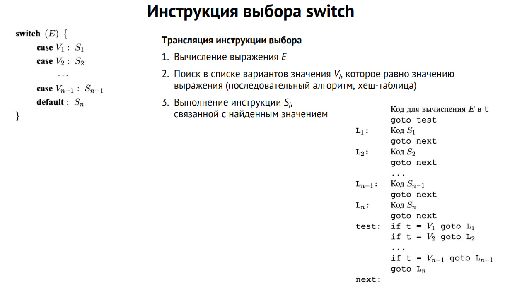
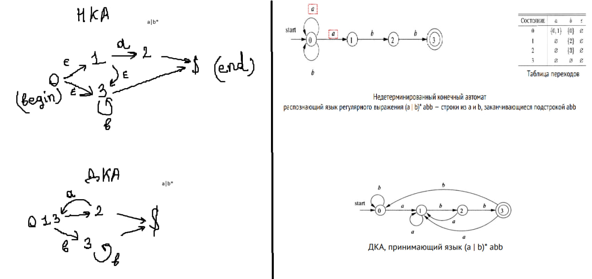

### Компилятор: Основные фазы, Статические и Динамические Компиляторы, Промежуточные Представления

**Компилятор** — это специализированная программа, которая преобразует исходный код, написанный на одном языке программирования (высокоуровневом языке), в эквивалентный код на другом языке (чаще всего низкоуровневом, таком как машинный код).

#### Основные фазы компиляции

Процесс компиляции обычно разбивается на несколько этапов (фаз), каждая из которых выполняет определённые задачи:

1. **Лексический анализ (сканирование)**
   - **Цель:** Разбиение исходного кода на лексемы (токены), которые являются минимальными значащими единицами (например, ключевые слова, идентификаторы, операторы).
   - **Инструменты:** Регулярные выражения, конечные автоматы.
   
2. **Синтаксический анализ (парсинг)**
   - **Цель:** Построение синтаксического дерева на основе лексем, которое отражает грамматическую структуру программы согласно правилам синтаксиса.
   - **Инструменты:** Контекстно-свободные грамматики, деревья разбора.
   
3. **Семантический анализ**
   - **Цель:** Проверка семантической правильности программы, включающая проверку типов, разрешение идентификаторов и контроль области видимости.
   - **Инструменты:** Таблицы символов, деревья синтаксического разбора, правила типизации.
   
4. **Генерация промежуточного кода**
   - **Цель:** Преобразование синтаксического дерева в промежуточное представление (ПП), которое является независимым от конкретной архитектуры машины.
   - **Инструменты:** Трехадресный код, статическое одно присваивание (SSA).
   
5. **Оптимизация промежуточного кода**
   - **Цель:** Улучшение промежуточного кода для повышения производительности и уменьшения использования ресурсов.
   - **Инструменты:** Оптимизации уровня выражений, цикл-независимые оптимизации, цикл-зависимые оптимизации.
   
6. **Генерация объектного кода**
   - **Цель:** Преобразование оптимизированного промежуточного кода в машинный код, специфичный для целевой архитектуры.
   - **Инструменты:** Шаблоны машинных инструкций, регистровое распределение.
   
7. **Оптимизация объектного кода**
   - **Цель:** Дополнительные оптимизации, применяемые уже к машинному коду.
   - **Инструменты:** Локальные и глобальные оптимизации, инлайнинг, разворачивание циклов.

#### Статические и динамические компиляторы

**Статические компиляторы** выполняют все фазы компиляции до выполнения программы. Результатом работы является исполняемый файл, который можно запускать многократно без повторной компиляции. Основные преимущества:
- Высокая производительность исполняемого кода.
- Возможность выполнения сложных и длительных оптимизаций.

**Динамические компиляторы** (также известные как JIT-компиляторы, от Just-In-Time) компилируют код во время выполнения программы. Они интегрируют фазы компиляции и исполнения, что позволяет учитывать конкретные данные и использование программы для оптимизации. Основные преимущества:
- Возможность выполнения агрессивных оптимизаций на основе реального использования.
- Повышенная гибкость в управлении кодом, особенно полезно для интерпретируемых языков.

#### Промежуточные представления

**Промежуточное представление (ПП)** — это форма представления программы, которая находится между исходным и объектным кодом. ПП служит для независимости от исходного и целевого языков, что позволяет проводить более эффективные и универсальные оптимизации.

Основные виды ПП:

1. **Абстрактное синтаксическое дерево (AST)**
   - Представляет синтаксическую структуру исходного кода в виде дерева, где узлы соответствуют конструкциям языка, а листья — лексемам.
   
2. **Трехадресный код**
   - Линейное представление программы, где каждая инструкция имеет не более трех операндов. Пример: `x = y + z`.
   
3. **Статическое одно присваивание (SSA)**
   - Вариант трехадресного кода, в котором каждая переменная присваивается только один раз, что упрощает анализ данных и оптимизацию.
   
4. **Байт-код**
   - Универсальный код, который может исполняться на виртуальной машине. Пример: Java байт-код для JVM.

Промежуточные представления используются для различных оптимизаций и обеспечивают независимость от целевой архитектуры, что делает процесс компиляции более модульным и гибким.


### Синтаксический анализ. Восходящий синтаксический анализ. Свертки. Обрезка основ. Конфликты в процессе ПС-анализа. Простой LR-анализатор. Алгоритм LR-анализа.

#### Синтаксический анализ

**Синтаксический анализ** (Parsing) — процесс проверки последовательности токенов на соответствие грамматике языка программирования и построения синтаксического дерева.

#### Восходящий синтаксический анализ


**Восходящий синтаксический анализ** (Bottom-Up Parsing) строит синтаксическое дерево от листьев (токенов входной строки) к корню (стартовому символу грамматики). Этот метод подходит для более широкого класса грамматик по сравнению с нисходящим анализом.

#### Свертки (Reductions)

**Свертка** — это процесс замены последовательности символов на ее порождающий нетерминал согласно правилам грамматики. Свертка начинается с токенов (листьев дерева) и продолжается до тех пор, пока не будет получен стартовый символ грамматики (корень дерева).

##### Пример:
Для грамматики:
```
E -> E + E
E -> E * E
E -> id
```
Входная строка: `id + id * id`

Процесс свертки:
1. Сканируем `id` и сворачиваем его в `E`.
2. Сканируем `+` и `id`, сворачиваем его в `E`.
3. Сканируем `*` и `id`, сворачиваем его в `E`.
4. Сворачиваем весь результат в `E`.


#### Обрезка основ (Shift)

**Обрезка основ** (Shift) — это процесс перемещения следующего токена из входной строки в стек. Восходящий синтаксический анализатор чередует обрезку и свертку, пока не будет достигнут полный разбор.

##### Пример:
Для входной строки `id + id` и грамматики:
```
E -> E + id
E -> id
```
Процесс разбора:
1. Обрезка `id` (сдвиг в стек).
2. Сворачиваем `id` в `E`.
3. Обрезка `+`.
4. Обрезка `id`.
5. Сворачиваем `id` в `E`.
6. Сворачиваем `E + E` в `E`.

#### Конфликты в процессе ПС-анализа


**Конфликты в процессе ПС-анализа** (Shift-Reduce Conflicts) возникают, когда анализатор не может однозначно решить, делать ли обрезку или свертку. Также возможны **Reduce-Reduce Conflicts**, когда несколько правил могут быть свернуты одновременно.

##### Пример конфликта:
Для грамматики:
```
E -> E + E
E -> E * E
E -> id
```
Входная строка: `id + id * id`

На стадии `id + id` анализатор может либо сворачивать `id + id` в `E`, либо продолжать обрезку и ждать `*`.

#### Простой LR-анализатор (SLR)

**Простой LR-анализатор (SLR)** — это тип LR-анализатора, который использует таблицы действий (Action Table) и переходов (Goto Table) для управления процессом разбора. SLR-анализатор базируется на LR(0)-автомате с добавлением множества следования (Follow Sets) для управления свертками.

##### Основные компоненты SLR-анализатора:
1. **Action Table**: указывает, следует ли выполнять обрезку, свертку или принять строку.
2. **Goto Table**: определяет переходы между состояниями для нетерминалов.
3. **Стек**: хранит состояния и символы, необходимые для разбора.

##### Пример работы SLR-анализатора:
Для грамматики:
```
E -> E + T
E -> T
T -> T * F
T -> F
F -> ( E )
F -> id
```
Таблицы разбора:

Action Table:
| State | id | +  | *  | (  | )  | $  |
|-------|----|----|----|----|----|----|
|   0   | S5 |    |    | S4 |    |    |
|   1   |    | S6 |    |    |    | Acc|
|   2   |    | R2 | S7 |    | R2 | R2 |
|   3   |    | R4 | R4 |    | R4 | R4 |
|   4   | S5 |    |    | S4 |    |    |
|   5   |    | R6 | R6 |    | R6 | R6 |
|   6   | S5 |    |    | S4 |    |    |
|   7   | S5 |    |    | S4 |    |    |

Goto Table:
| State | E  | T  | F  |
|-------|----|----|----|
|   0   | 1  | 2  | 3  |
|   4   | 8  | 2  | 3  |
|   6   |    | 9  | 3  |
|   7   |    |    | 10 |


#### Алгоритм LR-анализа


**Алгоритм LR-анализа** (Left-to-right, Rightmost derivation) управляется таблицами и стеком. Он использует следующее:

1. **Инициализация**: в стек помещаются начальное состояние и символ `$`.
2. **Action Table**: определяет, следует ли выполнять обрезку, свертку или принять строку.
3. **Goto Table**: используется для переходов между состояниями после свертки.
4. **Сдвиг (Shift)**: перемещает следующий символ из входной строки в стек.
5. **Свертка (Reduce)**: заменяет несколько символов в стеке на их нетерминал по правилу грамматики.
6. **Принятие (Accept)**: завершает разбор, если входная строка полностью разобрана.

##### Пример работы:
Для входной строки `id + id * id` и приведенной выше грамматики.

1. Стек: 0, Вход: id + id * id$
2. Action[0, id] = S5 -> Стек: 0, id, 5, Вход: + id * id$
3. Action[5, +] = R6 (F -> id) -> Стек: 0, F, 3
4. Goto[0, F] = 3 -> Стек: 0, F, 3
5. Action[3, +] = R4 (T -> F) -> Стек: 0, T, 2
6. Goto[0, T] = 2 -> Стек: 0, T, 2
7. Action[2, +] = S6 -> Стек: 0, T, 2, +, 6, Вход: id * id$
8. Action[6, id] = S5 -> Стек: 0, T, 2, +, 6, id, 5, Вход: * id$
9. Action[5, *] = R6 (F -> id) -> Стек: 0, T, 2, +, T, 9
10. Goto[6, F] = 3 -> Стек: 0, T, 2, +, T, 9
11. Action[9, *] = S7 -> Стек: 0, T, 2, +, T, 9, *, 7, Вход: id$
12. Action[7, id] = S5 -> Стек: 0, T, 2, +, T, 9, *, id, 5, Вход: $
13. Action[5, $] = R6 (F -> id) -> Стек: 0, T, 2, +, T, 9, *, F, 10
14. Goto[7, F] = 3 -> Стек: 0, T, 2, +, T, 9, *, F, 10
15. Action[10, $] = R4 (T -> T * F) -> Стек: 0, T, 2, +, T, 9
16. Action[9, $] = R2 (E -> T) -> Стек: 0, E, 1
17. Goto[0, E] = 1 -> Стек: 0, E, 1
18. Action[1, $] = Acc -> Принятие

### Заключение

Восходящий синтаксический анализ является мощным методом разбора, позволяющим обрабатывать широкий класс грамматик. Простой LR-анализатор и алгоритм LR-анализа используют таблицы действий и переходов для эффективного управления процессом разбора, чередуя сдвиги и св

ертки. Эти методы обеспечивают точное и эффективное построение синтаксического дерева, что делает их важными инструментами в компиляторных технологиях.


### Генерация промежуточного кода. Трехадресный код. SSA. Трансляция выражений в трёхадресный код.

#### Генерация промежуточного кода


**Генерация промежуточного кода** — это этап компиляции, на котором исходный код преобразуется в промежуточное представление (IR), более близкое к машинному коду, но все еще независимое от конкретной архитектуры процессора. Промежуточный код удобен для дальнейшей оптимизации и генерации целевого кода.

#### Трехадресный код

**Трехадресный код (Three-Address Code, TAC)** — это форма промежуточного представления, в котором каждая инструкция может содержать не более трех адресов (операндов). Операнды могут быть переменными, константами или временными значениями. TAC удобен для оптимизации и генерации машинного кода.

##### Пример TAC:
```
t1 = a + b
t2 = t1 * c
t3 = t2 / d
```

##### Основные формы инструкций TAC:
1. **Присваивание**: `x = y op z`
2. **Унарные операции**: `x = op y`
3. **Копирование**: `x = y`
4. **Безусловный переход**: `goto L`
5. **Условный переход**: `if x relop y goto L`
6. **Процедурные вызовы**: `call p, n`
7. **Возврат значения**: `return x`

#### SSA (Static Single Assignment)

**Static Single Assignment (SSA)** — это форма промежуточного представления, в котором каждая переменная определяется ровно один раз, и после определения её значение не изменяется. SSA улучшает возможности оптимизации за счет упрощения анализа данных и управления зависимостями между переменными.

##### Преобразование в SSA:
1. **Преименование переменных**: каждое присваивание переменной создает новую версию переменной.
2. **Вставка φ-функций**: для объединения значений из нескольких предшествующих блоков.

##### Пример:
Исходный код:
```
x = a + b
x = x * c
```
Преобразованный в SSA:
```
x1 = a + b
x2 = x1 * c
```

#### Трансляция выражений в трёхадресный код

Трансляция выражений из исходного кода в трехадресный код включает разбиение выражений на простые операции, которые можно легко сопоставить с инструкциями трехадресного кода.

##### Шаги трансляции:
1. **Разбор выражения**: синтаксический анализ для построения дерева выражений.
2. **Построение трехадресного кода**: рекурсивная генерация кода для каждого подвыражения.

##### Пример:
Выражение: `a + b * c`

Построение дерева выражений:
```
    +
   / \
  a   *
     / \
    b   c
```

Трансляция в трехадресный код:
```
t1 = b * c
t2 = a + t1
```

### Заключение

Генерация промежуточного кода является важным этапом компиляции, обеспечивающим платформонезависимое представление программ. Трехадресный код и SSA значительно упрощают оптимизацию и последующую генерацию машинного кода. Трансляция выражений в трехадресный код — это процесс разбиения сложных выражений на простые операции, что делает их удобными для дальнейшей обработки и оптимизации.


### Генерация промежуточного кода. Трансляция обращений к массиву

#### Трансляция обращений к массиву

Обращения к массиву требуют вычисления адреса элемента на основе индекса и, возможно, размеров элементов. Пусть `A` — массив, `i` — индекс элемента, а `base` — базовый адрес массива. Размер одного элемента массива обозначим как `size`.

Для простоты рассмотрим одномерный массив. Формула вычисления адреса элемента:
```
address = base + i * size
```

##### Пример:
```
A[i]
```
Пусть `base` — базовый адрес массива `A`, `size` — размер элемента массива.

Промежуточный код:
```
t1 = i * size
t2 = base + t1
```

Для многомерного массива, например `A[i][j]`, требуется учитывать размеры всех измерений. Пусть `width` — число столбцов.

Формула вычисления адреса элемента:
```
address = base + (i * width + j) * size
```

##### Пример:
```
A[i][j]
```
Пусть `base` — базовый адрес массива `A`, `width` — число столбцов, `size` — размер элемента массива.

Промежуточный код:
```
t1 = i * width
t2 = t1 + j
t3 = t2 * size
t4 = base + t3
```

<br><br>

### Генерация промежуточного кода. Вычисления булевых выражений по сокращенной схеме

#### Трансляция булевых выражений

Сокращенная схема вычисления булевых выражений (short-circuit evaluation) позволяет избежать вычисления всех частей выражения, если результат уже ясен. 

##### Логическое И (AND):
Выражение: `a && b`
- Если `a` ложь (`false`), то `b` не вычисляется, результат `false`.
- Если `a` истина (`true`), то результат зависит от `b`.

##### Пример:
```
a && b
```

Промежуточный код:
```
if a == false goto L1
if b == true goto L2
L1:
t1 = false
goto L3
L2:
t1 = true
L3:
```

##### Логическое ИЛИ (OR):
Выражение: `a || b`
- Если `a` истина (`true`), то `b` не вычисляется, результат `true`.
- Если `a` ложь (`false`), то результат зависит от `b`.

##### Пример:
```
a || b
```

Промежуточный код:
```
if a == true goto L1
if b == true goto L1
t1 = false
goto L2
L1:
t1 = true
L2:
```
<br><br>
### Генерация промежуточного кода. Трансляция if-then-else

#### Трансляция if-then-else

Конструкция `if-then-else` требует условного перехода в промежуточном коде. Ветвление на основе условия осуществляется с помощью инструкций условного и безусловного переходов.

##### Пример:
```
if (a > b) {
    S1;
} else {
    S2;
}
```

Промежуточный код:
```
if a > b goto L1
goto L2
L1:
    S1
    goto L3
L2:
    S2
L3:
```
<br><br>
### Генерация промежуточного кода. Трансляция цикла while

#### Трансляция цикла while

Конструкция `while` требует создания цикла с условным проверочным переходом.

##### Пример:
```
while (a < b) {
    S;
}
```

Промежуточный код:
```
L1:
if a >= b goto L2
    S
goto L1
L2:
```

### Switch


### Заключение

Трансляция выражений для обращений к массиву, булевых выражений по сокращенной схеме, конструкций `if-then-else` и циклов `while` требует генерирования промежуточного кода с использованием арифметических и логических операций, а также инструкций условных и безусловных переходов. Эти схемы позволяют эффективно и точно реализовать логику исходного кода на уровне промежуточного представления, готового к дальнейшей оптимизации и генерации машинного кода.


### Понятие формального языка. Синтаксис языка. Семантика. Регулярные выражения для описания языков.

#### Понятие формального языка

**Формальный язык** — это множество строк, сформированных из определённого алфавита по заданным правилам. Формальные языки используются для точного определения синтаксиса программных языков и в других областях компьютерной науки, таких как теория автоматов и грамматик.

- **Алфавит** — конечный набор символов.
- **Строка (слово)** — конечная последовательность символов из алфавита.
- **Язык** — множество строк, сформированных из данного алфавита.

#### Синтаксис языка

**Синтаксис** — это правила, определяющие корректные последовательности символов (или токенов) в языке. Он описывает структуру программы, определяя, какие комбинации символов являются допустимыми конструкциями языка.

- **Синтаксическая категория** — класс конструкций языка (например, выражения, операторы, декларации).
- **Грамматика** — формальное описание синтаксиса языка.

##### Контекстно-свободная грамматика (CFG)

Контекстно-свободные грамматики широко используются для определения синтаксиса языков программирования. CFG состоит из:
- **Нетерминалов** (Non-terminals): символы, представляющие синтаксические категории.
- **Терминалов** (Terminals): символы алфавита языка.
- **Стартового символа** (Start symbol): нетерминал, с которого начинается разбор.
- **Правил продукции** (Production rules): правила для замены нетерминалов последовательностями терминалов и/или нетерминалов.

Пример:
```
E -> E + T | T
T -> T * F | F
F -> (E) | id
```
Этот пример описывает простую грамматику арифметических выражений.

#### Семантика

**Семантика** — это набор правил, определяющих значение конструкций языка. Она описывает поведение программы при её выполнении.

Существует несколько типов семантики:
- **Операционная семантика** (Operational semantics): описывает выполнение программы как последовательность шагов выполнения.
- **Денотационная семантика** (Denotational semantics): определяет значение программ как математические объекты.
- **Аксматическая семантика** (Axiomatic semantics): использует логические утверждения для описания свойств программы.

#### Регулярные выражения для описания языков

**Регулярные выражения (Regular Expressions)** — мощный инструмент для описания регулярных языков, которые могут быть распознаны конечными автоматами. Они используются для определения лексического синтаксиса в компиляторах.

Основные конструкции регулярных выражений:
- **Символы**: `a`, `b`, `c` и т.д.
- **Конкатенация**: `ab` — строка, состоящая из `a` и `b`.
- **Альтернатива**: `a|b` — либо `a`, либо `b`.
- **Клоз звезда**: `a*` — ноль или более повторений `a`.
- **Клоз плюс**: `a+` — одно или более повторений `a`.
- **Вопросительный знак**: `a?` — ноль или одно появление `a`.
- **Классы символов**: `[a-z]` — любой символ от `a` до `z`.

Пример:
```
a(b|c)*d
```
Этот регулярное выражение описывает строки, начинающиеся с `a`, за которыми следует любая последовательность `b` или `c`, и заканчивающиеся на `d`.

Регулярные выражения играют ключевую роль в лексическом анализе, так как они используются для определения шаблонов токенов, таких как ключевые слова, идентификаторы, операторы и литералы.

#### Пример применения

Рассмотрим, как эти понятия могут использоваться в компиляторе. Например, при компиляции программы компилятор сначала применяет регулярные выражения для лексического анализа, чтобы выделить токены из исходного кода. Затем он использует синтаксический анализ для построения синтаксического дерева на основе контекстно-свободной грамматики. После этого семантический анализ проверяет смысловую корректность программы, перед тем как перейти к промежуточному представлению и дальнейшим фазам компиляции.


### Формальные грамматики. Эквивалентные грамматики. Иерархия Хомского. Форма Бэкуса-Наура.

#### Формальные грамматики

**Формальная грамматика** — это система правил, используемая для определения синтаксиса языка. Грамматика состоит из:

- **Алфавита**: конечного набора символов, из которых строятся строки языка.
- **Нетерминалов** (Non-terminals): символов, представляющих синтаксические категории.
- **Терминалов** (Terminals): символов алфавита языка.
- **Стартового символа** (Start symbol): нетерминала, с которого начинается построение.
- **Правил продукции** (Production rules): правил, определяющих, как нетерминалы могут быть заменены последовательностями терминалов и/или нетерминалов.

Пример формальной грамматики:
```
E -> E + T | T
T -> T * F | F
F -> (E) | id
```

#### Эквивалентные грамматики

**Эквивалентные грамматики** — это грамматики, порождающие один и тот же язык. Они могут иметь разные правила продукции, но любое предложение, которое может быть получено одной грамматикой, может быть получено и другой.

Пример:
```
Грамматика 1:
S -> aS | b

Грамматика 2:
S -> aA | b
A -> S
```
Обе грамматики порождают язык, состоящий из всех строк, оканчивающихся на 'b' и содержащих любое количество 'a' перед этим.

#### Иерархия Хомского

Иерархия Хомского классифицирует грамматики на четыре уровня в зависимости от их выразительной силы:

1. **Тип 0: Неограниченные грамматики**
   - Правила: α -> β, где α и β — любые строки символов (α не может быть пустым).
   - Соответствуют: Машины Тьюринга.

2. **Тип 1: Контекстно-зависимые грамматики**
   - Правила: αAβ -> αγβ, где A — нетерминал, α, β, γ — любые строки символов (γ не может быть пустым).
   - Соответствуют: Линейно ограниченные автоматы.

3. **Тип 2: Контекстно-свободные грамматики (CFG)**
   - Правила: A -> γ, где A — нетерминал, γ — любая строка терминалов и/или нетерминалов.
   - Соответствуют: Недетерминированные автоматы со стеком (PDA).

4. **Тип 3: Регулярные грамматики**
   - Правила: A -> aB | a, где A и B — нетерминалы, a — терминал.
   - Соответствуют: Конечные автоматы.

#### Форма Бэкуса-Наура

**Форма Бэкуса-Наура (BNF)** — это нотация для выражения контекстно-свободных грамматик. Она была разработана для описания синтаксиса языков программирования.

Основные элементы BNF:
- **Нетерминал**: обозначается в угловых скобках, например, `<expression>`.
- **Терминал**: конкретный символ или строка символов.
- **Правило продукции**: записывается в виде `<nonterminal> ::= <expression>`, где `::=` означает "заменяется на".
- **Альтернатива**: записывается через вертикальную черту `|`, например, `<digit> ::= 0 | 1 | 2 | ... | 9`.

Пример BNF для арифметических выражений:
```
<expression> ::= <term> | <expression> + <term>
<term> ::= <factor> | <term> * <factor>
<factor> ::= ( <expression> ) | <number>
<number> ::= <digit> | <number> <digit>
<digit> ::= 0 | 1 | 2 | 3 | 4 | 5 | 6 | 7 | 8 | 9
```

BNF и её расширенные версии (EBNF) широко используются для формального описания синтаксиса языков программирования и других формальных языков.


### Синтаксически управляемая трансляция. Деревья разбора. Семантические правила.


#### Синтаксически управляемая трансляция

**Синтаксически управляемая трансляция** (Syntax-Directed Translation, SDT) — это метод, используемый в компиляторах для связывания семантических действий с грамматическими правилами. Эти действия выполняются при построении синтаксического дерева или анализе входной строки, чтобы генерировать выходной код или промежуточное представление программы.

##### Элементы SDT:

1. **Атрибуты**: значения, связанные с узлами дерева разбора. Атрибуты могут быть двух типов:
   - **Синтезируемые атрибуты** (Synthesized attributes): вычисляются на основе атрибутов дочерних узлов.
   - **Наследуемые атрибуты** (Inherited attributes): передаются от родительских или соседних узлов.

2. **Семантические действия**: процедуры или инструкции, которые выполняются, когда применяется правило грамматики. Они могут изменять атрибуты, генерировать промежуточный код или выполнять другие действия.

##### Пример SDT:
```
E -> E1 + T { E.val = E1.val + T.val }
T -> T1 * F { T.val = T1.val * F.val }
F -> (E) { F.val = E.val }
F -> id { F.val = id.val }
```
Здесь `E.val`, `T.val`, и `F.val` — это синтезируемые атрибуты.

#### Деревья разбора

**Дерево разбора** (Parse Tree) — это дерево, которое представляет синтаксическую структуру входной строки согласно правилам грамматики. Узлы дерева разбора соответствуют символам грамматики (терминалам и нетерминалам), а листья — терминалам входной строки.

##### Пример дерева разбора:
Для выражения `3 + 4 * 5` и грамматики:
```
E -> E + T | T
T -> T * F | F
F -> (E) | id
```
Дерево разбора будет выглядеть так:
```
      E
     /|\
    E + T
   /   /|\
  T   T * F
 /   /     \
F   F       id
|   |       |
id  id      5
|   |
3   4
```

#### Семантические правила

**Семантические правила** — это инструкции, которые определяют, как вычисляются атрибуты в узлах дерева разбора. Эти правила могут быть ассоциированы с продукциями грамматики.

##### Пример семантических правил:
Для вышеуказанной грамматики семантические правила могут быть следующими:
```
E -> E + T { E.val = E1.val + T.val }
T -> T * F { T.val = T1.val * F.val }
F -> (E) { F.val = E.val }
F -> id { F.val = id.val }
```
Здесь `E.val`, `T.val`, и `F.val` — синтезируемые атрибуты, которые используются для вычисления значений в соответствующих узлах дерева разбора.


##### Наследуемые и синтезируемые атрибуты:
- **Синтезируемые атрибуты**: вычисляются на основе значений дочерних узлов.
- **Наследуемые атрибуты**: передаются от родительских или соседних узлов.


##### Пример использования атрибутов:
```
E -> T E'
E' -> + T { E'.inh = E.inh + T.val } E'1 { E.val = E'1.val }
E' -> ε { E.val = E.inh }
T -> id { T.val = id.val }
```
Здесь `E'` и `E'1` имеют синтезируемые атрибуты `val` и наследуемые атрибуты `inh`.

### Пример SDT в реальном языке программирования

Рассмотрим пример из языков программирования с выражениями и операциями:
```
expr -> expr + term { expr.val = expr1.val + term.val }
      | term { expr.val = term.val }

term -> term * factor { term.val = term1.val * factor.val }
      | factor { term.val = factor.val }

factor -> ( expr ) { factor.val = expr.val }
       | num { factor.val = num.val }
```
Для выражения `3 + 5 * 2` синтаксически управляемая трансляция будет выглядеть следующим образом:
```
expr -> expr + term
     -> term + term
     -> factor + term
     -> num + term
     -> 3 + term
     -> 3 + term * factor
     -> 3 + factor * factor
     -> 3 + num * factor
     -> 3 + 5 * factor
     -> 3 + 5 * num
     -> 3 + 5 * 2
```
В процессе трансляции используются семантические правила для вычисления значений выражений.


### Нисходящий анализ. Анализ методом рекурсивного спуска. Левая рекурсия в продукциях. Абстрактное синтаксическое дерево.

#### Нисходящий анализ

**Нисходящий анализ** (Top-Down Parsing) — это метод синтаксического анализа, который строит дерево разбора от корня к листьям. Нисходящий анализ начинается с стартового символа грамматики и пытается последовательно сопоставить входную строку с продукциями грамматики.

Основные методы нисходящего анализа:
1. **Анализ методом рекурсивного спуска**.
2. **LL-анализ**.

#### Анализ методом рекурсивного спуска

**Анализ методом рекурсивного спуска** (Recursive Descent Parsing) — это простой и интуитивный метод нисходящего синтаксического анализа, в котором для каждого нетерминала грамматики существует отдельная рекурсивная функция. Каждая функция пытается распознать часть входной строки, соответствующую своему нетерминалу, и вызывает другие функции для нетерминалов, присутствующих в правой части своих продукций.

##### Пример:

Рассмотрим грамматику для простых арифметических выражений:
```
E -> T E'
E' -> + T E' | ε
T -> F T'
T' -> * F T' | ε
F -> ( E ) | id
```


Пример кода на Python для рекурсивного спуска:
```python
tokens = ...  # список токенов входной строки
current_token = 0

def match(expected_token):
    global current_token
    if tokens[current_token] == expected_token:
        current_token += 1
    else:
        raise SyntaxError(f"Expected {expected_token}, found {tokens[current_token]}")

def E():
    T()
    E_prime()

def E_prime():
    if tokens[current_token] == '+':
        match('+')
        T()
        E_prime()

def T():
    F()
    T_prime()

def T_prime():
    if tokens[current_token] == '*':
        match('*')
        F()
        T_prime()

def F():
    if tokens[current_token] == '(':
        match('(')
        E()
        match(')')
    elif tokens[current_token] == 'id':
        match('id')
    else:
        raise SyntaxError(f"Unexpected token: {tokens[current_token]}")

# Запуск анализа
E()
if current_token < len(tokens):
    raise SyntaxError("Unexpected end of input")
```

#### Левая рекурсия в продукциях

**Левая рекурсия** — это ситуация, когда в грамматике присутствует продукция вида `A -> Aα`, где `A` — нетерминал, а `α` — любая строка символов. Левая рекурсия вызывает проблемы для рекурсивного спуска, так как приводит к бесконечной рекурсии.

##### Пример левой рекурсии:
```
E -> E + T | T
```

Для устранения левой рекурсии можно преобразовать грамматику:
```
E -> T E'
E' -> + T E' | ε
```

#### Абстрактное синтаксическое дерево

**Абстрактное синтаксическое дерево (AST)** — это упрощённое представление синтаксической структуры программы, которое фокусируется на важной семантической информации и опускает несущественные синтаксические детали (например, круглые скобки, знаки пунктуации).

##### Пример:
Для выражения `3 + 4 * 5` дерево разбора (Parse Tree) будет выглядеть так:

```
      E
     /|\
    E + T
   /   /|\
  T   T * F
 /   /     \
F   F       id
|   |       |
id  id      5
|   |
3   4
```

Абстрактное синтаксическое дерево (AST) для того же выражения будет следующим:

```
    +
   / \
  3   *
     / \
    4   5
```

В AST сохраняется только структурная информация, необходимая для последующих этапов компиляции или интерпретации.


### Заключение

Нисходящий анализ, особенно метод рекурсивного спуска, является простым и эффективным методом синтаксического анализа, подходящим для грамматик без левой рекурсии. Абстрактные синтаксические деревья упрощают последующую обработку кода, сохраняя только существенные элементы его структуры.


### Таблица символов. Область видимости. Цепочки таблиц символов. Лексический анализ. Регулярные выражения. Архитектура лексического анализатора на основе диаграммы переходов.

#### Таблица символов

**Таблица символов** (Symbol Table) — это структура данных, используемая компиляторами для хранения информации о различных идентификаторах (переменных, функциях, типах и т.д.), используемых в исходном коде. Таблица символов обеспечивает эффективный доступ к этой информации во время компиляции.

##### Основные функции таблицы символов:
- **Вставка**: добавление новых идентификаторов.
- **Поиск**: нахождение информации об идентификаторе.
- **Удаление**: удаление идентификаторов (обычно при выходе из области видимости).
- **Обновление**: изменение информации об идентификаторах.

##### Пример информации, хранящейся в таблице символов:
- Имя идентификатора.
- Тип идентификатора (переменная, функция, тип и т.д.).
- Область видимости.
- Адрес в памяти или смещение.
- Другие атрибуты (например, константность, параметры функции).


#### Область видимости

**Область видимости** (Scope) — это часть программы, в пределах которой идентификатор (переменная, функция и т.д.) является видимым и может быть использован.

##### Виды областей видимости:
- **Локальная область видимости**: идентификатор виден только внутри блока кода (например, внутри функции или блока).
- **Глобальная область видимости**: идентификатор виден во всей программе.
- **Вложенные области видимости**: внутренние области видимости могут переопределять идентификаторы из внешних областей видимости.


#### Цепочки таблиц символов

**Цепочки таблиц символов** (Symbol Table Chains) — это механизм, позволяющий поддерживать вложенные области видимости. Для каждой новой области видимости создается новая таблица символов, которая ссылается на таблицу символов родительской области видимости.

##### Пример:
```
void function() {
    int x;      // Локальная переменная в функции
    {
        int y;  // Локальная переменная в блоке
    }
}
```
В данном примере создаются две таблицы символов: одна для функции, другая для внутреннего блока.


#### Лексический анализ

**Лексический анализ** (Lexical Analysis) — это первый этап компиляции, на котором исходный код разбивается на токены — элементарные синтаксические единицы (ключевые слова, идентификаторы, операторы, литералы и т.д.).

##### Основные задачи лексического анализатора:
- Чтение исходного кода.
- Распознавание токенов.
- Игнорирование пробелов и комментариев.
- Обработка ошибок на уровне лексики.

#### Регулярные выражения

**Регулярные выражения** (Regular Expressions) — это формальные языковые конструкции, используемые для описания шаблонов строк. В лексическом анализе регулярные выражения применяются для определения шаблонов токенов.

##### Пример регулярных выражений для токенов:
- Идентификатор: `[a-zA-Z_][a-zA-Z0-9_]*`
- Целое число: `[0-9]+`
- Пробелы: `[ \t\n\r]+`

#### Архитектура лексического анализатора на основе диаграммы переходов

**Диаграммы переходов** (Transition Diagrams) — это графы, где вершины представляют состояния, а ребра — переходы между состояниями, вызванные чтением символов. Лексический анализатор на основе диаграмм переходов моделирует конечный автомат.

##### Основные компоненты диаграммы переходов:
- **Начальное состояние** (Start State).
- **Конечные состояния** (Accepting States).
- **Переходы** (Transitions), помеченные символами или классами символов.

##### Пример:
Рассмотрим простой лексический анализатор для чисел и идентификаторов:
```
(START) --> [a-zA-Z] --> (ID_STATE) -- [a-zA-Z0-9] --> (ID_STATE)
(START) --> [0-9] --> (NUM_STATE) -- [0-9] --> (NUM_STATE)
(ID_STATE) --> [^a-zA-Z0-9] --> (ACCEPT_ID)
(NUM_STATE) --> [^0-9] --> (ACCEPT_NUM)
```

В этом примере `START` — начальное состояние, `ID_STATE` — состояние распознавания идентификатора, `NUM_STATE` — состояние распознавания числа, `ACCEPT_ID` и `ACCEPT_NUM` — конечные состояния.

### Заключение

Таблицы символов, области видимости и цепочки таблиц символов играют ключевую роль в управлении идентификаторами и их областями видимости в компиляторе. Лексический анализ, используя регулярные выражения и диаграммы переходов, обеспечивает эффективное разбиение исходного кода на токены, подготавливая его к дальнейшим этапам синтаксического и семантического анализа.


### Переход от регулярных выражений к конечным автоматам. Построение НКА. Конвертация НКА в ДКА. Моделирование НКА.

#### Переход от регулярных выражений к конечным автоматам


Регулярные выражения (РВ) часто используются для описания токенов в лексическом анализе. Чтобы распознавать эти токены, регулярные выражения преобразуются в конечные автоматы (КА), которые можно эффективно реализовать в виде программ.

#### Построение НКА (Недетерминированного Конечного Автомата)


**Недетерминированный конечный автомат (НКА)** — это автомат, который может находиться в нескольких состояниях одновременно или делать переходы без чтения символов (ε-переходы).

##### Основные шаги построения НКА из регулярного выражения:
1. **Конкатенация** (Concatenation): для РВ `ab` создается НКА, последовательно соединяющий автоматы для `a` и `b`.
2. **Объединение** (Union): для РВ `a|b` создается НКА, который может перейти в автомат для `a` или `b`.
3. **Клебе замыкание** (Kleene Star): для РВ `a*` создается НКА, который позволяет многократные (или нулевые) повторения `a`.

##### Пример построения НКА:
Для регулярного выражения `a|b*` НКА будет следующим:
```
       ε
    -->0--->1--->a--->2
    |        |
    |        ε
    |        v
    +--->3--->b--->3
          ^
          |
          ε
```
В этом примере 0 — начальное состояние, 2 и 3 — конечные состояния.

#### Конвертация НКА в ДКА



**Детерминированный конечный автомат (ДКА)** — это автомат, который в каждый момент времени находится в одном состоянии и делает переходы только по прочитанным символам, без ε-переходов.

##### Алгоритм конвертации НКА в ДКА (алгоритм Томпсона или алгоритм подмножеств):
1. **Начальное состояние** ДКА соответствует множеству состояний НКА, достижимых из начального состояния НКА по ε-переходам.
2. Для каждого состояния ДКА и каждого символа входного алфавита вычисляется множество состояний НКА, достижимых по этому символу и ε-переходам (формируется новое состояние ДКА).
3. Процесс повторяется, пока не будут рассмотрены все состояния и символы.

##### Пример:
Конвертация НКА из предыдущего примера (`a|b*`) в ДКА:
```
Состояния НКА | Символ a | Символ b | ε-переходы
---------------------------------------------------
{0, 1, 3}     | {2}      | {3}      | {0, 1, 3}
{2}           | -        | -        | -
{3}           | -        | {3}      | {3}
```
ДКА будет:
```
Состояния | Символ a | Символ b
--------------------------------
{0, 1, 3} | {2}      | {3}
{2}       | {0, 1, 3} | -
{3}       | -        | {3}
```
Начальное состояние: {0, 1, 3}, конечные состояния: {2}, {3}.

#### Моделирование НКА

**Моделирование НКА** заключается в выполнении алгоритма, который учитывает возможность нахождения в нескольких состояниях одновременно и использования ε-переходов.

##### Основные шаги моделирования НКА:
1. Инициализация текущего множества состояний как множество начальных состояний.
2. Чтение символа из входной строки.
3. Обновление текущего множества состояний путем перехода в новые состояния для прочитанного символа и ε-переходов.
4. Повторение шагов 2-3 до конца входной строки.
5. Проверка наличия хотя бы одного конечного состояния в текущем множестве состояний.

##### Пример:
Для НКА из примера `a|b*` и входной строки `bb`:
1. Начальное состояние: {0, 1, 3}
2. Чтение `b`: переходим в состояние {3}
3. Чтение `b`: остаемся в состоянии {3}
4. Конечное состояние {3} достигнуто, входная строка принимается.

### Заключение

Переход от регулярных выражений к конечным автоматам позволяет эффективно реализовать лексический анализатор. Построение НКА, конвертация НКА в ДКА и моделирование НКА — это ключевые шаги в этом процессе. НКА позволяют легко построить автомат для любого регулярного выражения, а ДКА обеспечивают эффективное выполнение анализа.


### Синтаксический анализ. Методы разбора. Устранение неоднозначности грамматики. Левая факторизация.

#### Синтаксический анализ

**Синтаксический анализ** (Parsing) — это процесс проверки соответствия последовательности токенов грамматике языка программирования. Цель синтаксического анализа — построение синтаксического дерева, представляющего структуру программы.

#### Методы синтаксического разбора

Основные методы синтаксического разбора включают нисходящий и восходящий разбор.

1. **Нисходящий разбор** (Top-Down Parsing):
    - Начинается с корня дерева разбора (стартового символа грамматики) и пытается развернуть его до листьев (токенов входной строки).
    - Примеры: рекурсивный спуск, LL-разбор.

2. **Восходящий разбор** (Bottom-Up Parsing):
    - Начинается с листьев дерева разбора (токенов входной строки) и пытается собрать их в более крупные структуры, поднимаясь к корню дерева.
    - Примеры: LR-разбор, SLR, LALR, Canonical LR.

#### Устранение неоднозначности грамматики

**Неоднозначная грамматика** — это грамматика, для которой существуют различные деревья разбора для одной и той же входной строки. Устранение неоднозначности важно для корректного синтаксического анализа.

##### Способы устранения неоднозначности:
1. **Определение приоритетов операторов**: Установка приоритетов операторов помогает разрешить неоднозначность.
2. **Левая факторизация**: Преобразование грамматики для устранения неоднозначных выборов.

##### Пример:
Для грамматики арифметических выражений:
```
E -> E + E
   | E * E
   | (E)
   | id
```
Эта грамматика неоднозначна, так как выражение `id + id * id` может быть разобрано двумя способами: `(id + id) * id` и `id + (id * id)`.

##### Решение:
Введение приоритетов и преобразование грамматики:
```
E -> E + T
   | T
T -> T * F
   | F
F -> (E)
   | id
```
Теперь грамматика однозначна, и `id + id * id` будет разбираться как `id + (id * id)`.

#### Левая факторизация

**Левая факторизация** — это процесс преобразования грамматики для устранения ситуации, когда для одного и того же нетерминала существуют альтернативные правила, начинающиеся с одного и того же символа. Это необходимо для корректного функционирования методов предиктивного разбора, таких как LL(1).

##### Пример:
Для грамматики:
```
A -> αβ1 | αβ2
```
Невозможно сразу выбрать, какое правило использовать, так как оба начинаются с α.

##### Преобразование:
```
A -> αA'
A' -> β1 | β2
```

##### Пример на практике:
Исходная грамматика:
```
S -> iEtS | iEtSeS | a
E -> b
```
Левая факторизация:
```
S -> iEtS S'
   | a
S' -> eS
   | ε
E -> b
```

### Заключение

Синтаксический анализ является важным этапом в компиляции, который гарантирует, что исходный код соответствует грамматике языка. Методы разбора включают нисходящие и восходящие подходы, каждый из которых имеет свои преимущества и недостатки. Устранение неоднозначности и левая факторизация необходимы для обеспечения корректности синтаксического анализа и упрощения построения синтаксического дерева.


### Нисходящий синтаксический анализ. LL(1)-грамматики. Предиктивный синтаксический анализ, управляемый таблицей.

#### Нисходящий синтаксический анализ

**Нисходящий синтаксический анализ** (Top-Down Parsing) строит дерево разбора от корня к листьям, начиная с стартового символа грамматики и последовательно сопоставляя его продукцию с токенами входной строки. Этот метод удобен для создания синтаксических анализаторов, так как его легко реализовать и понять.

#### LL(1)-грамматики

**LL(1)-грамматики** — это подмножество контекстно-свободных грамматик, которые можно распознавать с помощью нисходящего анализа без возвратов (backtracking). "LL" обозначает "слева направо" (Left-to-right) разбор и "левое порождение" (Leftmost derivation), а "1" означает, что анализатор принимает решение, глядя на один токен вперед.

##### Условия для LL(1)-грамматики:
1. **Отсутствие левой рекурсии**: LL(1)-грамматика не должна содержать левой рекурсии.
2. **Левая факторизация**: LL(1)-грамматика не должна содержать альтернативных правил, начинающихся с одного и того же символа.

##### Пример LL(1)-грамматики:
```
E -> T E'
E' -> + T E' | ε
T -> F T'
T' -> * F T' | ε
F -> ( E ) | id
```

#### Предиктивный синтаксический анализ, управляемый таблицей

**Предиктивный синтаксический анализ, управляемый таблицей** (Table-Driven Predictive Parsing) — это метод LL(1)-анализа, в котором используется таблица синтаксического анализа (Parsing Table) для принятия решений о разборе. Таблица определяет, какую продукцию грамматики применять, исходя из текущего состояния и текущего символа входной строки.

##### Основные компоненты предиктивного анализатора:
1. **Стек**: хранит состояния и символы, необходимые для разбора.
2. **Вход**: последовательность токенов, представляющих исходный код.
3. **Таблица синтаксического анализа**: двумерная таблица, строки которой соответствуют нетерминалам, а столбцы — символам входного алфавита (токенам).

##### Пример таблицы синтаксического анализа:
Для грамматики:
```
E -> T E'
E' -> + T E' | ε
T -> F T'
T' -> * F T' | ε
F -> ( E ) | id
```
Таблица синтаксического анализа будет выглядеть так:

|   | id  | +   | *   | (   | )   | $   |
|---|-----|-----|-----|-----|-----|-----|
| E | E -> TE' |     |     | E -> TE' |     |     |
| E'|     | E' -> +TE'|     |     | E' -> ε | E' -> ε |
| T | T -> FT' |     |     | T -> FT' |     |     |
| T'|     | T' -> ε  | T' -> *FT'|     | T' -> ε | T' -> ε |
| F | F -> id  |     |     | F -> (E)|     |     |

##### Алгоритм работы предиктивного анализатора:
1. Инициализация стека: в стек помещается стартовый символ грамматики и символ конца входа `$`.
2. Чтение текущего символа входной строки.
3. Сравнение вершины стека с текущим символом:
    - Если они совпадают, символ удаляется из стека, и входной символ потребляется (переход к следующему символу).
    - Если вершина стека — нетерминал, используется таблица синтаксического анализа для выбора правила продукции. Продукция заменяет нетерминал на стеке.
    - Если нет совпадения и нетерминал не найден в таблице, происходит ошибка синтаксического анализа.
4. Повторение шагов 2-3 до тех пор, пока стек не опустеет или не будет обнаружена ошибка.

##### Пример работы анализатора:
Для входной строки `id + id * id`:
```
1. Стек: E$, Вход: id + id * id$
2. E -> TE', Стек: TE'$, Вход: id + id * id$
3. T -> FT', Стек: FT'E'$, Вход: id + id * id$
4. F -> id, Стек: idT'E'$, Вход: id + id * id$
5. Совпадение id, Стек: T'E'$, Вход: + id * id$
6. T' -> ε, Стек: E'$, Вход: + id * id$
7. E' -> +TE', Стек: +TE'$, Вход: + id * id$
8. Совпадение +, Стек: TE'$, Вход: id * id$
9. T -> FT', Стек: FT'E'$, Вход: id * id$
10. F -> id, Стек: idT'E'$, Вход: id * id$
11. Совпадение id, Стек: T'E'$, Вход: * id$
12. T' -> *FT', Стек: *FT'E'$, Вход: * id$
13. Совпадение *, Стек: FT'E'$, Вход: id$
14. F -> id, Стек: idT'E'$, Вход: id$
15. Совпадение id, Стек: T'E'$, Вход: $
16. T' -> ε, Стек: E'$, Вход: $
17. E' -> ε, Стек: $, Вход: $
18. Успешный разбор
```

### Заключение

Нисходящий синтаксический анализ, особенно предиктивный синтаксический анализ, управляемый таблицей, предоставляет эффективный и понятный метод разбора для LL(1)-грамматик. Эти грамматики легко анализируются без необходимости возвратов, что упрощает процесс создания компиляторов и интерпретаторов.


|    **Question**   | **Difficulty** |
|:-----------------:|:--------------:|
|     [1](1.md)     |        🟢       |
|     [2](2.md)     |        🟢       |
|     [3](3.md)     |        🟢       |
|     [4](4.md)     |        🟢       |
|     [5](5.md)     |        🟢       |
|     [6](6.md)     |        🟢       |
|     [7](7.md)     |        🟡       |
|     [8](8.md)     |        🟢       |
|     [9](9.md)     |        🟡       |
|    [10](10.md)    |        🟠       |
|    [11](11.md)    |        🟢       |
| [12-15](12-15.md) |        🟢       |
### All text is generated by OpenAI's GPT-4o
Most answers are good and strongly related to Aho & Lam & Sethi & Ullman's Dragon Book<br>
######  (read it)
<br>
Author of this repository is not responsible for correctness of any text information *or/and* your final exam grades


### Компилятор: Основные фазы, Статические и Динамические Компиляторы, Промежуточные Представления

**Компилятор** — это специализированная программа, которая преобразует исходный код, написанный на одном языке программирования (высокоуровневом языке), в эквивалентный код на другом языке (чаще всего низкоуровневом, таком как машинный код).

#### Основные фазы компиляции

Процесс компиляции обычно разбивается на несколько этапов (фаз), каждая из которых выполняет определённые задачи:

1. **Лексический анализ (сканирование)**
   - **Цель:** Разбиение исходного кода на лексемы (токены), которые являются минимальными значащими единицами (например, ключевые слова, идентификаторы, операторы).
   - **Инструменты:** Регулярные выражения, конечные автоматы.
   
2. **Синтаксический анализ (парсинг)**
   - **Цель:** Построение синтаксического дерева на основе лексем, которое отражает грамматическую структуру программы согласно правилам синтаксиса.
   - **Инструменты:** Контекстно-свободные грамматики, деревья разбора.
   
3. **Семантический анализ**
   - **Цель:** Проверка семантической правильности программы, включающая проверку типов, разрешение идентификаторов и контроль области видимости.
   - **Инструменты:** Таблицы символов, деревья синтаксического разбора, правила типизации.
   
4. **Генерация промежуточного кода**
   - **Цель:** Преобразование синтаксического дерева в промежуточное представление (ПП), которое является независимым от конкретной архитектуры машины.
   - **Инструменты:** Трехадресный код, статическое одно присваивание (SSA).
   
5. **Оптимизация промежуточного кода**
   - **Цель:** Улучшение промежуточного кода для повышения производительности и уменьшения использования ресурсов.
   - **Инструменты:** Оптимизации уровня выражений, цикл-независимые оптимизации, цикл-зависимые оптимизации.
   
6. **Генерация объектного кода**
   - **Цель:** Преобразование оптимизированного промежуточного кода в машинный код, специфичный для целевой архитектуры.
   - **Инструменты:** Шаблоны машинных инструкций, регистровое распределение.
   
7. **Оптимизация объектного кода**
   - **Цель:** Дополнительные оптимизации, применяемые уже к машинному коду.
   - **Инструменты:** Локальные и глобальные оптимизации, инлайнинг, разворачивание циклов.

#### Статические и динамические компиляторы

**Статические компиляторы** выполняют все фазы компиляции до выполнения программы. Результатом работы является исполняемый файл, который можно запускать многократно без повторной компиляции. Основные преимущества:
- Высокая производительность исполняемого кода.
- Возможность выполнения сложных и длительных оптимизаций.

**Динамические компиляторы** (также известные как JIT-компиляторы, от Just-In-Time) компилируют код во время выполнения программы. Они интегрируют фазы компиляции и исполнения, что позволяет учитывать конкретные данные и использование программы для оптимизации. Основные преимущества:
- Возможность выполнения агрессивных оптимизаций на основе реального использования.
- Повышенная гибкость в управлении кодом, особенно полезно для интерпретируемых языков.

#### Промежуточные представления

**Промежуточное представление (ПП)** — это форма представления программы, которая находится между исходным и объектным кодом. ПП служит для независимости от исходного и целевого языков, что позволяет проводить более эффективные и универсальные оптимизации.

Основные виды ПП:

1. **Абстрактное синтаксическое дерево (AST)**
   - Представляет синтаксическую структуру исходного кода в виде дерева, где узлы соответствуют конструкциям языка, а листья — лексемам.
   
2. **Трехадресный код**
   - Линейное представление программы, где каждая инструкция имеет не более трех операндов. Пример: `x = y + z`.
   
3. **Статическое одно присваивание (SSA)**
   - Вариант трехадресного кода, в котором каждая переменная присваивается только один раз, что упрощает анализ данных и оптимизацию.
   
4. **Байт-код**
   - Универсальный код, который может исполняться на виртуальной машине. Пример: Java байт-код для JVM.

Промежуточные представления используются для различных оптимизаций и обеспечивают независимость от целевой архитектуры, что делает процесс компиляции более модульным и гибким.


### Синтаксический анализ. Восходящий синтаксический анализ. Свертки. Обрезка основ. Конфликты в процессе ПС-анализа. Простой LR-анализатор. Алгоритм LR-анализа.

#### Синтаксический анализ

**Синтаксический анализ** (Parsing) — процесс проверки последовательности токенов на соответствие грамматике языка программирования и построения синтаксического дерева.

#### Восходящий синтаксический анализ


**Восходящий синтаксический анализ** (Bottom-Up Parsing) строит синтаксическое дерево от листьев (токенов входной строки) к корню (стартовому символу грамматики). Этот метод подходит для более широкого класса грамматик по сравнению с нисходящим анализом.

#### Свертки (Reductions)

**Свертка** — это процесс замены последовательности символов на ее порождающий нетерминал согласно правилам грамматики. Свертка начинается с токенов (листьев дерева) и продолжается до тех пор, пока не будет получен стартовый символ грамматики (корень дерева).

##### Пример:
Для грамматики:
```
E -> E + E
E -> E * E
E -> id
```
Входная строка: `id + id * id`

Процесс свертки:
1. Сканируем `id` и сворачиваем его в `E`.
2. Сканируем `+` и `id`, сворачиваем его в `E`.
3. Сканируем `*` и `id`, сворачиваем его в `E`.
4. Сворачиваем весь результат в `E`.


#### Обрезка основ (Shift)

**Обрезка основ** (Shift) — это процесс перемещения следующего токена из входной строки в стек. Восходящий синтаксический анализатор чередует обрезку и свертку, пока не будет достигнут полный разбор.

##### Пример:
Для входной строки `id + id` и грамматики:
```
E -> E + id
E -> id
```
Процесс разбора:
1. Обрезка `id` (сдвиг в стек).
2. Сворачиваем `id` в `E`.
3. Обрезка `+`.
4. Обрезка `id`.
5. Сворачиваем `id` в `E`.
6. Сворачиваем `E + E` в `E`.

#### Конфликты в процессе ПС-анализа


**Конфликты в процессе ПС-анализа** (Shift-Reduce Conflicts) возникают, когда анализатор не может однозначно решить, делать ли обрезку или свертку. Также возможны **Reduce-Reduce Conflicts**, когда несколько правил могут быть свернуты одновременно.

##### Пример конфликта:
Для грамматики:
```
E -> E + E
E -> E * E
E -> id
```
Входная строка: `id + id * id`

На стадии `id + id` анализатор может либо сворачивать `id + id` в `E`, либо продолжать обрезку и ждать `*`.

#### Простой LR-анализатор (SLR)

**Простой LR-анализатор (SLR)** — это тип LR-анализатора, который использует таблицы действий (Action Table) и переходов (Goto Table) для управления процессом разбора. SLR-анализатор базируется на LR(0)-автомате с добавлением множества следования (Follow Sets) для управления свертками.

##### Основные компоненты SLR-анализатора:
1. **Action Table**: указывает, следует ли выполнять обрезку, свертку или принять строку.
2. **Goto Table**: определяет переходы между состояниями для нетерминалов.
3. **Стек**: хранит состояния и символы, необходимые для разбора.

##### Пример работы SLR-анализатора:
Для грамматики:
```
E -> E + T
E -> T
T -> T * F
T -> F
F -> ( E )
F -> id
```
Таблицы разбора:

Action Table:
| State | id | +  | *  | (  | )  | $  |
|-------|----|----|----|----|----|----|
|   0   | S5 |    |    | S4 |    |    |
|   1   |    | S6 |    |    |    | Acc|
|   2   |    | R2 | S7 |    | R2 | R2 |
|   3   |    | R4 | R4 |    | R4 | R4 |
|   4   | S5 |    |    | S4 |    |    |
|   5   |    | R6 | R6 |    | R6 | R6 |
|   6   | S5 |    |    | S4 |    |    |
|   7   | S5 |    |    | S4 |    |    |

Goto Table:
| State | E  | T  | F  |
|-------|----|----|----|
|   0   | 1  | 2  | 3  |
|   4   | 8  | 2  | 3  |
|   6   |    | 9  | 3  |
|   7   |    |    | 10 |


#### Алгоритм LR-анализа


**Алгоритм LR-анализа** (Left-to-right, Rightmost derivation) управляется таблицами и стеком. Он использует следующее:

1. **Инициализация**: в стек помещаются начальное состояние и символ `$`.
2. **Action Table**: определяет, следует ли выполнять обрезку, свертку или принять строку.
3. **Goto Table**: используется для переходов между состояниями после свертки.
4. **Сдвиг (Shift)**: перемещает следующий символ из входной строки в стек.
5. **Свертка (Reduce)**: заменяет несколько символов в стеке на их нетерминал по правилу грамматики.
6. **Принятие (Accept)**: завершает разбор, если входная строка полностью разобрана.

##### Пример работы:
Для входной строки `id + id * id` и приведенной выше грамматики.

1. Стек: 0, Вход: id + id * id$
2. Action[0, id] = S5 -> Стек: 0, id, 5, Вход: + id * id$
3. Action[5, +] = R6 (F -> id) -> Стек: 0, F, 3
4. Goto[0, F] = 3 -> Стек: 0, F, 3
5. Action[3, +] = R4 (T -> F) -> Стек: 0, T, 2
6. Goto[0, T] = 2 -> Стек: 0, T, 2
7. Action[2, +] = S6 -> Стек: 0, T, 2, +, 6, Вход: id * id$
8. Action[6, id] = S5 -> Стек: 0, T, 2, +, 6, id, 5, Вход: * id$
9. Action[5, *] = R6 (F -> id) -> Стек: 0, T, 2, +, T, 9
10. Goto[6, F] = 3 -> Стек: 0, T, 2, +, T, 9
11. Action[9, *] = S7 -> Стек: 0, T, 2, +, T, 9, *, 7, Вход: id$
12. Action[7, id] = S5 -> Стек: 0, T, 2, +, T, 9, *, id, 5, Вход: $
13. Action[5, $] = R6 (F -> id) -> Стек: 0, T, 2, +, T, 9, *, F, 10
14. Goto[7, F] = 3 -> Стек: 0, T, 2, +, T, 9, *, F, 10
15. Action[10, $] = R4 (T -> T * F) -> Стек: 0, T, 2, +, T, 9
16. Action[9, $] = R2 (E -> T) -> Стек: 0, E, 1
17. Goto[0, E] = 1 -> Стек: 0, E, 1
18. Action[1, $] = Acc -> Принятие

### Заключение

Восходящий синтаксический анализ является мощным методом разбора, позволяющим обрабатывать широкий класс грамматик. Простой LR-анализатор и алгоритм LR-анализа используют таблицы действий и переходов для эффективного управления процессом разбора, чередуя сдвиги и св

ертки. Эти методы обеспечивают точное и эффективное построение синтаксического дерева, что делает их важными инструментами в компиляторных технологиях.


### Генерация промежуточного кода. Трехадресный код. SSA. Трансляция выражений в трёхадресный код.

#### Генерация промежуточного кода


**Генерация промежуточного кода** — это этап компиляции, на котором исходный код преобразуется в промежуточное представление (IR), более близкое к машинному коду, но все еще независимое от конкретной архитектуры процессора. Промежуточный код удобен для дальнейшей оптимизации и генерации целевого кода.

#### Трехадресный код

**Трехадресный код (Three-Address Code, TAC)** — это форма промежуточного представления, в котором каждая инструкция может содержать не более трех адресов (операндов). Операнды могут быть переменными, константами или временными значениями. TAC удобен для оптимизации и генерации машинного кода.

##### Пример TAC:
```
t1 = a + b
t2 = t1 * c
t3 = t2 / d
```

##### Основные формы инструкций TAC:
1. **Присваивание**: `x = y op z`
2. **Унарные операции**: `x = op y`
3. **Копирование**: `x = y`
4. **Безусловный переход**: `goto L`
5. **Условный переход**: `if x relop y goto L`
6. **Процедурные вызовы**: `call p, n`
7. **Возврат значения**: `return x`

#### SSA (Static Single Assignment)

**Static Single Assignment (SSA)** — это форма промежуточного представления, в котором каждая переменная определяется ровно один раз, и после определения её значение не изменяется. SSA улучшает возможности оптимизации за счет упрощения анализа данных и управления зависимостями между переменными.

##### Преобразование в SSA:
1. **Преименование переменных**: каждое присваивание переменной создает новую версию переменной.
2. **Вставка φ-функций**: для объединения значений из нескольких предшествующих блоков.

##### Пример:
Исходный код:
```
x = a + b
x = x * c
```
Преобразованный в SSA:
```
x1 = a + b
x2 = x1 * c
```

#### Трансляция выражений в трёхадресный код

Трансляция выражений из исходного кода в трехадресный код включает разбиение выражений на простые операции, которые можно легко сопоставить с инструкциями трехадресного кода.

##### Шаги трансляции:
1. **Разбор выражения**: синтаксический анализ для построения дерева выражений.
2. **Построение трехадресного кода**: рекурсивная генерация кода для каждого подвыражения.

##### Пример:
Выражение: `a + b * c`

Построение дерева выражений:
```
    +
   / \
  a   *
     / \
    b   c
```

Трансляция в трехадресный код:
```
t1 = b * c
t2 = a + t1
```

### Заключение

Генерация промежуточного кода является важным этапом компиляции, обеспечивающим платформонезависимое представление программ. Трехадресный код и SSA значительно упрощают оптимизацию и последующую генерацию машинного кода. Трансляция выражений в трехадресный код — это процесс разбиения сложных выражений на простые операции, что делает их удобными для дальнейшей обработки и оптимизации.


### Генерация промежуточного кода. Трансляция обращений к массиву

#### Трансляция обращений к массиву

Обращения к массиву требуют вычисления адреса элемента на основе индекса и, возможно, размеров элементов. Пусть `A` — массив, `i` — индекс элемента, а `base` — базовый адрес массива. Размер одного элемента массива обозначим как `size`.

Для простоты рассмотрим одномерный массив. Формула вычисления адреса элемента:
```
address = base + i * size
```

##### Пример:
```
A[i]
```
Пусть `base` — базовый адрес массива `A`, `size` — размер элемента массива.

Промежуточный код:
```
t1 = i * size
t2 = base + t1
```

Для многомерного массива, например `A[i][j]`, требуется учитывать размеры всех измерений. Пусть `width` — число столбцов.

Формула вычисления адреса элемента:
```
address = base + (i * width + j) * size
```

##### Пример:
```
A[i][j]
```
Пусть `base` — базовый адрес массива `A`, `width` — число столбцов, `size` — размер элемента массива.

Промежуточный код:
```
t1 = i * width
t2 = t1 + j
t3 = t2 * size
t4 = base + t3
```

<br><br>

### Генерация промежуточного кода. Вычисления булевых выражений по сокращенной схеме

#### Трансляция булевых выражений

Сокращенная схема вычисления булевых выражений (short-circuit evaluation) позволяет избежать вычисления всех частей выражения, если результат уже ясен. 

##### Логическое И (AND):
Выражение: `a && b`
- Если `a` ложь (`false`), то `b` не вычисляется, результат `false`.
- Если `a` истина (`true`), то результат зависит от `b`.

##### Пример:
```
a && b
```

Промежуточный код:
```
if a == false goto L1
if b == true goto L2
L1:
t1 = false
goto L3
L2:
t1 = true
L3:
```

##### Логическое ИЛИ (OR):
Выражение: `a || b`
- Если `a` истина (`true`), то `b` не вычисляется, результат `true`.
- Если `a` ложь (`false`), то результат зависит от `b`.

##### Пример:
```
a || b
```

Промежуточный код:
```
if a == true goto L1
if b == true goto L1
t1 = false
goto L2
L1:
t1 = true
L2:
```
<br><br>
### Генерация промежуточного кода. Трансляция if-then-else

#### Трансляция if-then-else

Конструкция `if-then-else` требует условного перехода в промежуточном коде. Ветвление на основе условия осуществляется с помощью инструкций условного и безусловного переходов.

##### Пример:
```
if (a > b) {
    S1;
} else {
    S2;
}
```

Промежуточный код:
```
if a > b goto L1
goto L2
L1:
    S1
    goto L3
L2:
    S2
L3:
```
<br><br>
### Генерация промежуточного кода. Трансляция цикла while

#### Трансляция цикла while

Конструкция `while` требует создания цикла с условным проверочным переходом.

##### Пример:
```
while (a < b) {
    S;
}
```

Промежуточный код:
```
L1:
if a >= b goto L2
    S
goto L1
L2:
```

### Switch


### Заключение

Трансляция выражений для обращений к массиву, булевых выражений по сокращенной схеме, конструкций `if-then-else` и циклов `while` требует генерирования промежуточного кода с использованием арифметических и логических операций, а также инструкций условных и безусловных переходов. Эти схемы позволяют эффективно и точно реализовать логику исходного кода на уровне промежуточного представления, готового к дальнейшей оптимизации и генерации машинного кода.


### Понятие формального языка. Синтаксис языка. Семантика. Регулярные выражения для описания языков.

#### Понятие формального языка

**Формальный язык** — это множество строк, сформированных из определённого алфавита по заданным правилам. Формальные языки используются для точного определения синтаксиса программных языков и в других областях компьютерной науки, таких как теория автоматов и грамматик.

- **Алфавит** — конечный набор символов.
- **Строка (слово)** — конечная последовательность символов из алфавита.
- **Язык** — множество строк, сформированных из данного алфавита.

#### Синтаксис языка

**Синтаксис** — это правила, определяющие корректные последовательности символов (или токенов) в языке. Он описывает структуру программы, определяя, какие комбинации символов являются допустимыми конструкциями языка.

- **Синтаксическая категория** — класс конструкций языка (например, выражения, операторы, декларации).
- **Грамматика** — формальное описание синтаксиса языка.

##### Контекстно-свободная грамматика (CFG)

Контекстно-свободные грамматики широко используются для определения синтаксиса языков программирования. CFG состоит из:
- **Нетерминалов** (Non-terminals): символы, представляющие синтаксические категории.
- **Терминалов** (Terminals): символы алфавита языка.
- **Стартового символа** (Start symbol): нетерминал, с которого начинается разбор.
- **Правил продукции** (Production rules): правила для замены нетерминалов последовательностями терминалов и/или нетерминалов.

Пример:
```
E -> E + T | T
T -> T * F | F
F -> (E) | id
```
Этот пример описывает простую грамматику арифметических выражений.

#### Семантика

**Семантика** — это набор правил, определяющих значение конструкций языка. Она описывает поведение программы при её выполнении.

Существует несколько типов семантики:
- **Операционная семантика** (Operational semantics): описывает выполнение программы как последовательность шагов выполнения.
- **Денотационная семантика** (Denotational semantics): определяет значение программ как математические объекты.
- **Аксматическая семантика** (Axiomatic semantics): использует логические утверждения для описания свойств программы.

#### Регулярные выражения для описания языков

**Регулярные выражения (Regular Expressions)** — мощный инструмент для описания регулярных языков, которые могут быть распознаны конечными автоматами. Они используются для определения лексического синтаксиса в компиляторах.

Основные конструкции регулярных выражений:
- **Символы**: `a`, `b`, `c` и т.д.
- **Конкатенация**: `ab` — строка, состоящая из `a` и `b`.
- **Альтернатива**: `a|b` — либо `a`, либо `b`.
- **Клоз звезда**: `a*` — ноль или более повторений `a`.
- **Клоз плюс**: `a+` — одно или более повторений `a`.
- **Вопросительный знак**: `a?` — ноль или одно появление `a`.
- **Классы символов**: `[a-z]` — любой символ от `a` до `z`.

Пример:
```
a(b|c)*d
```
Этот регулярное выражение описывает строки, начинающиеся с `a`, за которыми следует любая последовательность `b` или `c`, и заканчивающиеся на `d`.

Регулярные выражения играют ключевую роль в лексическом анализе, так как они используются для определения шаблонов токенов, таких как ключевые слова, идентификаторы, операторы и литералы.

#### Пример применения

Рассмотрим, как эти понятия могут использоваться в компиляторе. Например, при компиляции программы компилятор сначала применяет регулярные выражения для лексического анализа, чтобы выделить токены из исходного кода. Затем он использует синтаксический анализ для построения синтаксического дерева на основе контекстно-свободной грамматики. После этого семантический анализ проверяет смысловую корректность программы, перед тем как перейти к промежуточному представлению и дальнейшим фазам компиляции.


### Формальные грамматики. Эквивалентные грамматики. Иерархия Хомского. Форма Бэкуса-Наура.

#### Формальные грамматики

**Формальная грамматика** — это система правил, используемая для определения синтаксиса языка. Грамматика состоит из:

- **Алфавита**: конечного набора символов, из которых строятся строки языка.
- **Нетерминалов** (Non-terminals): символов, представляющих синтаксические категории.
- **Терминалов** (Terminals): символов алфавита языка.
- **Стартового символа** (Start symbol): нетерминала, с которого начинается построение.
- **Правил продукции** (Production rules): правил, определяющих, как нетерминалы могут быть заменены последовательностями терминалов и/или нетерминалов.

Пример формальной грамматики:
```
E -> E + T | T
T -> T * F | F
F -> (E) | id
```

#### Эквивалентные грамматики

**Эквивалентные грамматики** — это грамматики, порождающие один и тот же язык. Они могут иметь разные правила продукции, но любое предложение, которое может быть получено одной грамматикой, может быть получено и другой.

Пример:
```
Грамматика 1:
S -> aS | b

Грамматика 2:
S -> aA | b
A -> S
```
Обе грамматики порождают язык, состоящий из всех строк, оканчивающихся на 'b' и содержащих любое количество 'a' перед этим.

#### Иерархия Хомского

Иерархия Хомского классифицирует грамматики на четыре уровня в зависимости от их выразительной силы:

1. **Тип 0: Неограниченные грамматики**
   - Правила: α -> β, где α и β — любые строки символов (α не может быть пустым).
   - Соответствуют: Машины Тьюринга.

2. **Тип 1: Контекстно-зависимые грамматики**
   - Правила: αAβ -> αγβ, где A — нетерминал, α, β, γ — любые строки символов (γ не может быть пустым).
   - Соответствуют: Линейно ограниченные автоматы.

3. **Тип 2: Контекстно-свободные грамматики (CFG)**
   - Правила: A -> γ, где A — нетерминал, γ — любая строка терминалов и/или нетерминалов.
   - Соответствуют: Недетерминированные автоматы со стеком (PDA).

4. **Тип 3: Регулярные грамматики**
   - Правила: A -> aB | a, где A и B — нетерминалы, a — терминал.
   - Соответствуют: Конечные автоматы.

#### Форма Бэкуса-Наура

**Форма Бэкуса-Наура (BNF)** — это нотация для выражения контекстно-свободных грамматик. Она была разработана для описания синтаксиса языков программирования.

Основные элементы BNF:
- **Нетерминал**: обозначается в угловых скобках, например, `<expression>`.
- **Терминал**: конкретный символ или строка символов.
- **Правило продукции**: записывается в виде `<nonterminal> ::= <expression>`, где `::=` означает "заменяется на".
- **Альтернатива**: записывается через вертикальную черту `|`, например, `<digit> ::= 0 | 1 | 2 | ... | 9`.

Пример BNF для арифметических выражений:
```
<expression> ::= <term> | <expression> + <term>
<term> ::= <factor> | <term> * <factor>
<factor> ::= ( <expression> ) | <number>
<number> ::= <digit> | <number> <digit>
<digit> ::= 0 | 1 | 2 | 3 | 4 | 5 | 6 | 7 | 8 | 9
```

BNF и её расширенные версии (EBNF) широко используются для формального описания синтаксиса языков программирования и других формальных языков.


### Синтаксически управляемая трансляция. Деревья разбора. Семантические правила.


#### Синтаксически управляемая трансляция

**Синтаксически управляемая трансляция** (Syntax-Directed Translation, SDT) — это метод, используемый в компиляторах для связывания семантических действий с грамматическими правилами. Эти действия выполняются при построении синтаксического дерева или анализе входной строки, чтобы генерировать выходной код или промежуточное представление программы.

##### Элементы SDT:

1. **Атрибуты**: значения, связанные с узлами дерева разбора. Атрибуты могут быть двух типов:
   - **Синтезируемые атрибуты** (Synthesized attributes): вычисляются на основе атрибутов дочерних узлов.
   - **Наследуемые атрибуты** (Inherited attributes): передаются от родительских или соседних узлов.

2. **Семантические действия**: процедуры или инструкции, которые выполняются, когда применяется правило грамматики. Они могут изменять атрибуты, генерировать промежуточный код или выполнять другие действия.

##### Пример SDT:
```
E -> E1 + T { E.val = E1.val + T.val }
T -> T1 * F { T.val = T1.val * F.val }
F -> (E) { F.val = E.val }
F -> id { F.val = id.val }
```
Здесь `E.val`, `T.val`, и `F.val` — это синтезируемые атрибуты.

#### Деревья разбора

**Дерево разбора** (Parse Tree) — это дерево, которое представляет синтаксическую структуру входной строки согласно правилам грамматики. Узлы дерева разбора соответствуют символам грамматики (терминалам и нетерминалам), а листья — терминалам входной строки.

##### Пример дерева разбора:
Для выражения `3 + 4 * 5` и грамматики:
```
E -> E + T | T
T -> T * F | F
F -> (E) | id
```
Дерево разбора будет выглядеть так:
```
      E
     /|\
    E + T
   /   /|\
  T   T * F
 /   /     \
F   F       id
|   |       |
id  id      5
|   |
3   4
```

#### Семантические правила

**Семантические правила** — это инструкции, которые определяют, как вычисляются атрибуты в узлах дерева разбора. Эти правила могут быть ассоциированы с продукциями грамматики.

##### Пример семантических правил:
Для вышеуказанной грамматики семантические правила могут быть следующими:
```
E -> E + T { E.val = E1.val + T.val }
T -> T * F { T.val = T1.val * F.val }
F -> (E) { F.val = E.val }
F -> id { F.val = id.val }
```
Здесь `E.val`, `T.val`, и `F.val` — синтезируемые атрибуты, которые используются для вычисления значений в соответствующих узлах дерева разбора.


##### Наследуемые и синтезируемые атрибуты:
- **Синтезируемые атрибуты**: вычисляются на основе значений дочерних узлов.
- **Наследуемые атрибуты**: передаются от родительских или соседних узлов.


##### Пример использования атрибутов:
```
E -> T E'
E' -> + T { E'.inh = E.inh + T.val } E'1 { E.val = E'1.val }
E' -> ε { E.val = E.inh }
T -> id { T.val = id.val }
```
Здесь `E'` и `E'1` имеют синтезируемые атрибуты `val` и наследуемые атрибуты `inh`.

### Пример SDT в реальном языке программирования

Рассмотрим пример из языков программирования с выражениями и операциями:
```
expr -> expr + term { expr.val = expr1.val + term.val }
      | term { expr.val = term.val }

term -> term * factor { term.val = term1.val * factor.val }
      | factor { term.val = factor.val }

factor -> ( expr ) { factor.val = expr.val }
       | num { factor.val = num.val }
```
Для выражения `3 + 5 * 2` синтаксически управляемая трансляция будет выглядеть следующим образом:
```
expr -> expr + term
     -> term + term
     -> factor + term
     -> num + term
     -> 3 + term
     -> 3 + term * factor
     -> 3 + factor * factor
     -> 3 + num * factor
     -> 3 + 5 * factor
     -> 3 + 5 * num
     -> 3 + 5 * 2
```
В процессе трансляции используются семантические правила для вычисления значений выражений.


### Нисходящий анализ. Анализ методом рекурсивного спуска. Левая рекурсия в продукциях. Абстрактное синтаксическое дерево.

#### Нисходящий анализ

**Нисходящий анализ** (Top-Down Parsing) — это метод синтаксического анализа, который строит дерево разбора от корня к листьям. Нисходящий анализ начинается с стартового символа грамматики и пытается последовательно сопоставить входную строку с продукциями грамматики.

Основные методы нисходящего анализа:
1. **Анализ методом рекурсивного спуска**.
2. **LL-анализ**.

#### Анализ методом рекурсивного спуска

**Анализ методом рекурсивного спуска** (Recursive Descent Parsing) — это простой и интуитивный метод нисходящего синтаксического анализа, в котором для каждого нетерминала грамматики существует отдельная рекурсивная функция. Каждая функция пытается распознать часть входной строки, соответствующую своему нетерминалу, и вызывает другие функции для нетерминалов, присутствующих в правой части своих продукций.

##### Пример:

Рассмотрим грамматику для простых арифметических выражений:
```
E -> T E'
E' -> + T E' | ε
T -> F T'
T' -> * F T' | ε
F -> ( E ) | id
```


Пример кода на Python для рекурсивного спуска:
```python
tokens = ...  # список токенов входной строки
current_token = 0

def match(expected_token):
    global current_token
    if tokens[current_token] == expected_token:
        current_token += 1
    else:
        raise SyntaxError(f"Expected {expected_token}, found {tokens[current_token]}")

def E():
    T()
    E_prime()

def E_prime():
    if tokens[current_token] == '+':
        match('+')
        T()
        E_prime()

def T():
    F()
    T_prime()

def T_prime():
    if tokens[current_token] == '*':
        match('*')
        F()
        T_prime()

def F():
    if tokens[current_token] == '(':
        match('(')
        E()
        match(')')
    elif tokens[current_token] == 'id':
        match('id')
    else:
        raise SyntaxError(f"Unexpected token: {tokens[current_token]}")

# Запуск анализа
E()
if current_token < len(tokens):
    raise SyntaxError("Unexpected end of input")
```

#### Левая рекурсия в продукциях

**Левая рекурсия** — это ситуация, когда в грамматике присутствует продукция вида `A -> Aα`, где `A` — нетерминал, а `α` — любая строка символов. Левая рекурсия вызывает проблемы для рекурсивного спуска, так как приводит к бесконечной рекурсии.

##### Пример левой рекурсии:
```
E -> E + T | T
```

Для устранения левой рекурсии можно преобразовать грамматику:
```
E -> T E'
E' -> + T E' | ε
```

#### Абстрактное синтаксическое дерево

**Абстрактное синтаксическое дерево (AST)** — это упрощённое представление синтаксической структуры программы, которое фокусируется на важной семантической информации и опускает несущественные синтаксические детали (например, круглые скобки, знаки пунктуации).

##### Пример:
Для выражения `3 + 4 * 5` дерево разбора (Parse Tree) будет выглядеть так:

```
      E
     /|\
    E + T
   /   /|\
  T   T * F
 /   /     \
F   F       id
|   |       |
id  id      5
|   |
3   4
```

Абстрактное синтаксическое дерево (AST) для того же выражения будет следующим:

```
    +
   / \
  3   *
     / \
    4   5
```

В AST сохраняется только структурная информация, необходимая для последующих этапов компиляции или интерпретации.


### Заключение

Нисходящий анализ, особенно метод рекурсивного спуска, является простым и эффективным методом синтаксического анализа, подходящим для грамматик без левой рекурсии. Абстрактные синтаксические деревья упрощают последующую обработку кода, сохраняя только существенные элементы его структуры.


### Таблица символов. Область видимости. Цепочки таблиц символов. Лексический анализ. Регулярные выражения. Архитектура лексического анализатора на основе диаграммы переходов.

#### Таблица символов

**Таблица символов** (Symbol Table) — это структура данных, используемая компиляторами для хранения информации о различных идентификаторах (переменных, функциях, типах и т.д.), используемых в исходном коде. Таблица символов обеспечивает эффективный доступ к этой информации во время компиляции.

##### Основные функции таблицы символов:
- **Вставка**: добавление новых идентификаторов.
- **Поиск**: нахождение информации об идентификаторе.
- **Удаление**: удаление идентификаторов (обычно при выходе из области видимости).
- **Обновление**: изменение информации об идентификаторах.

##### Пример информации, хранящейся в таблице символов:
- Имя идентификатора.
- Тип идентификатора (переменная, функция, тип и т.д.).
- Область видимости.
- Адрес в памяти или смещение.
- Другие атрибуты (например, константность, параметры функции).


#### Область видимости

**Область видимости** (Scope) — это часть программы, в пределах которой идентификатор (переменная, функция и т.д.) является видимым и может быть использован.

##### Виды областей видимости:
- **Локальная область видимости**: идентификатор виден только внутри блока кода (например, внутри функции или блока).
- **Глобальная область видимости**: идентификатор виден во всей программе.
- **Вложенные области видимости**: внутренние области видимости могут переопределять идентификаторы из внешних областей видимости.


#### Цепочки таблиц символов

**Цепочки таблиц символов** (Symbol Table Chains) — это механизм, позволяющий поддерживать вложенные области видимости. Для каждой новой области видимости создается новая таблица символов, которая ссылается на таблицу символов родительской области видимости.

##### Пример:
```
void function() {
    int x;      // Локальная переменная в функции
    {
        int y;  // Локальная переменная в блоке
    }
}
```
В данном примере создаются две таблицы символов: одна для функции, другая для внутреннего блока.


#### Лексический анализ

**Лексический анализ** (Lexical Analysis) — это первый этап компиляции, на котором исходный код разбивается на токены — элементарные синтаксические единицы (ключевые слова, идентификаторы, операторы, литералы и т.д.).

##### Основные задачи лексического анализатора:
- Чтение исходного кода.
- Распознавание токенов.
- Игнорирование пробелов и комментариев.
- Обработка ошибок на уровне лексики.

#### Регулярные выражения

**Регулярные выражения** (Regular Expressions) — это формальные языковые конструкции, используемые для описания шаблонов строк. В лексическом анализе регулярные выражения применяются для определения шаблонов токенов.

##### Пример регулярных выражений для токенов:
- Идентификатор: `[a-zA-Z_][a-zA-Z0-9_]*`
- Целое число: `[0-9]+`
- Пробелы: `[ \t\n\r]+`

#### Архитектура лексического анализатора на основе диаграммы переходов

**Диаграммы переходов** (Transition Diagrams) — это графы, где вершины представляют состояния, а ребра — переходы между состояниями, вызванные чтением символов. Лексический анализатор на основе диаграмм переходов моделирует конечный автомат.

##### Основные компоненты диаграммы переходов:
- **Начальное состояние** (Start State).
- **Конечные состояния** (Accepting States).
- **Переходы** (Transitions), помеченные символами или классами символов.

##### Пример:
Рассмотрим простой лексический анализатор для чисел и идентификаторов:
```
(START) --> [a-zA-Z] --> (ID_STATE) -- [a-zA-Z0-9] --> (ID_STATE)
(START) --> [0-9] --> (NUM_STATE) -- [0-9] --> (NUM_STATE)
(ID_STATE) --> [^a-zA-Z0-9] --> (ACCEPT_ID)
(NUM_STATE) --> [^0-9] --> (ACCEPT_NUM)
```

В этом примере `START` — начальное состояние, `ID_STATE` — состояние распознавания идентификатора, `NUM_STATE` — состояние распознавания числа, `ACCEPT_ID` и `ACCEPT_NUM` — конечные состояния.

### Заключение

Таблицы символов, области видимости и цепочки таблиц символов играют ключевую роль в управлении идентификаторами и их областями видимости в компиляторе. Лексический анализ, используя регулярные выражения и диаграммы переходов, обеспечивает эффективное разбиение исходного кода на токены, подготавливая его к дальнейшим этапам синтаксического и семантического анализа.


### Переход от регулярных выражений к конечным автоматам. Построение НКА. Конвертация НКА в ДКА. Моделирование НКА.

#### Переход от регулярных выражений к конечным автоматам


Регулярные выражения (РВ) часто используются для описания токенов в лексическом анализе. Чтобы распознавать эти токены, регулярные выражения преобразуются в конечные автоматы (КА), которые можно эффективно реализовать в виде программ.

#### Построение НКА (Недетерминированного Конечного Автомата)


**Недетерминированный конечный автомат (НКА)** — это автомат, который может находиться в нескольких состояниях одновременно или делать переходы без чтения символов (ε-переходы).

##### Основные шаги построения НКА из регулярного выражения:
1. **Конкатенация** (Concatenation): для РВ `ab` создается НКА, последовательно соединяющий автоматы для `a` и `b`.
2. **Объединение** (Union): для РВ `a|b` создается НКА, который может перейти в автомат для `a` или `b`.
3. **Клебе замыкание** (Kleene Star): для РВ `a*` создается НКА, который позволяет многократные (или нулевые) повторения `a`.

##### Пример построения НКА:
Для регулярного выражения `a|b*` НКА будет следующим:
```
       ε
    -->0--->1--->a--->2
    |        |
    |        ε
    |        v
    +--->3--->b--->3
          ^
          |
          ε
```
В этом примере 0 — начальное состояние, 2 и 3 — конечные состояния.

#### Конвертация НКА в ДКА


**Детерминированный конечный автомат (ДКА)** — это автомат, который в каждый момент времени находится в одном состоянии и делает переходы только по прочитанным символам, без ε-переходов.

##### Алгоритм конвертации НКА в ДКА (алгоритм Томпсона или алгоритм подмножеств):
1. **Начальное состояние** ДКА соответствует множеству состояний НКА, достижимых из начального состояния НКА по ε-переходам.
2. Для каждого состояния ДКА и каждого символа входного алфавита вычисляется множество состояний НКА, достижимых по этому символу и ε-переходам (формируется новое состояние ДКА).
3. Процесс повторяется, пока не будут рассмотрены все состояния и символы.

##### Пример:
Конвертация НКА из предыдущего примера (`a|b*`) в ДКА:
```
Состояния НКА | Символ a | Символ b | ε-переходы
---------------------------------------------------
{0, 1, 3}     | {2}      | {3}      | {0, 1, 3}
{2}           | -        | -        | -
{3}           | -        | {3}      | {3}
```
ДКА будет:
```
Состояния | Символ a | Символ b
--------------------------------
{0, 1, 3} | {2}      | {3}
{2}       | {0, 1, 3} | -
{3}       | -        | {3}
```
Начальное состояние: {0, 1, 3}, конечные состояния: {2}, {3}.

#### Моделирование НКА

**Моделирование НКА** заключается в выполнении алгоритма, который учитывает возможность нахождения в нескольких состояниях одновременно и использования ε-переходов.

##### Основные шаги моделирования НКА:
1. Инициализация текущего множества состояний как множество начальных состояний.
2. Чтение символа из входной строки.
3. Обновление текущего множества состояний путем перехода в новые состояния для прочитанного символа и ε-переходов.
4. Повторение шагов 2-3 до конца входной строки.
5. Проверка наличия хотя бы одного конечного состояния в текущем множестве состояний.

##### Пример:
Для НКА из примера `a|b*` и входной строки `bb`:
1. Начальное состояние: {0, 1, 3}
2. Чтение `b`: переходим в состояние {3}
3. Чтение `b`: остаемся в состоянии {3}
4. Конечное состояние {3} достигнуто, входная строка принимается.

### Заключение

Переход от регулярных выражений к конечным автоматам позволяет эффективно реализовать лексический анализатор. Построение НКА, конвертация НКА в ДКА и моделирование НКА — это ключевые шаги в этом процессе. НКА позволяют легко построить автомат для любого регулярного выражения, а ДКА обеспечивают эффективное выполнение анализа.


